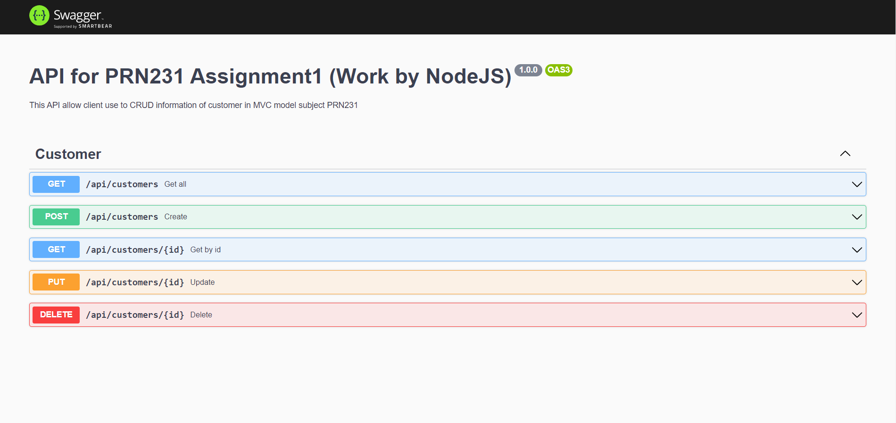

## Make APIs by NodeJS/ExpressJS - SwaggerUI/OpenAPI

#### Demo:


#### Technicals in project:
- NodeJS
- Microsoft SQL Server

#### Prerequisites:
Make sure you already have Microsoft SQL Server and NodeJS in computer. If not, you can download
- MS SQL Server
```sh
https://www.microsoft.com/en-us/sql-server/sql-server-downloads

```
- NodeJS
```sh
https://nodejs.org/en/download
```

#### Installation
1. Create an empty folder
2. Open the terminal, change direct to that folder and type:
```sh
git clone https://github.com/phunlh2001/Express-SwaggerUI.git
```
3. After clone success, type `yarn` to install dependencies
4. Enjoy!!